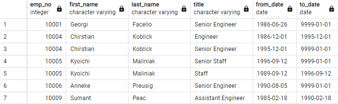
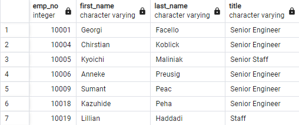
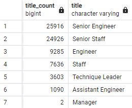
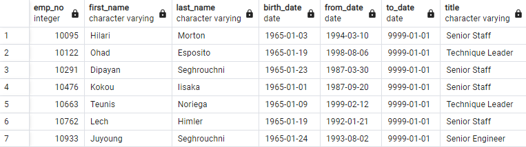

# Pewlett Hackard Analysis

  

## Overview of the Analysis

  

### Purpose
The purpose of this analysis is to determine the number of retiring employees per title and identify employees who are eligible to participate in a mentorship program.

  

## Results

 - Retirement Titles
 - 
 
 - Unique Titles
 - 
  
 - Retiring Titles

  
 - Mentorship Eligibility
 
 

## Summary
Based on the Results, we can see that a total of 72,358 positions will need to be filled spanning 7 different roles as the silver tsunami beings to make an  impact. Fortunately, there are enough retirement-ready employees in the departments to mentor the 1549 mentorship-eligible employees.

If we were to look into this further, it may be helpful to examine the salaries and departments tables. The salaries table could show us the starting salaries for all retiring employees giving us insight into the salary a new hire for that role should get. The departments table will allow us to see the total number of retiring positions per department.
